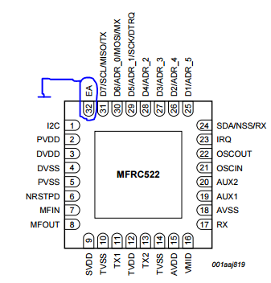

I changed the original code really much. Just take a look at this.

# Switching to UART

Cut the VCC pull-up of the `EA` pin (32). You can optionally connect it to GND, but it's really hard.

# Connecting

* MISO = TX
* SDA = RX

So you will have

RX  |  - | -  | TX  | -  | GND |  - | 3V3
--- | --- | --- | --- | --- | --- | --- | ---
